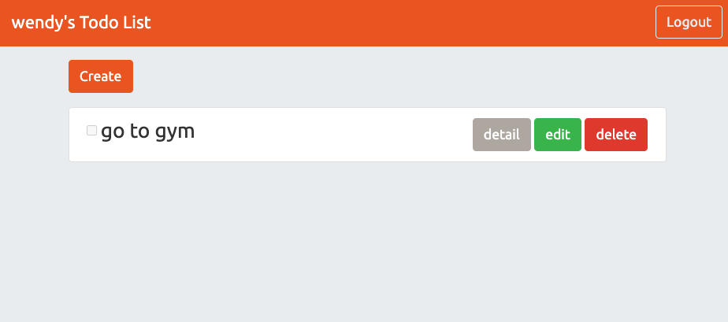

# 我的Todo List


## Description

This is a website created by node.js Express. 
- 使用者可以註冊、登入、並建立屬於自己的 To-do list
- 使用者可以新增一筆 todo 並指定名稱
- 使用者可以瀏覽全部 todo 清單
- 使用者可以查看特定 todo 的詳細資料
- 使用者可以編輯一筆 todo 的名稱與完成狀態
- 使用者可以刪除一筆 todo


### Executing program

1. Open terminal and git clone
```
git clone https://github.com/wenrou77/todo_sequelize.git
```

2. Initialization
```
npm install  //install packages
```

3. Execute

- To run on the index page
```
npm run dev
```
- Login using testing account
```
email: 'root@example.com'
password: '12345678'
```

## Authors

Wendy (wendy@gmail.com)
